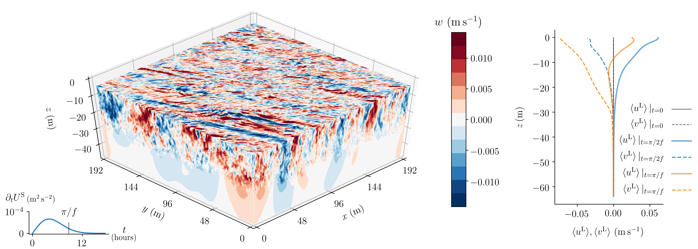
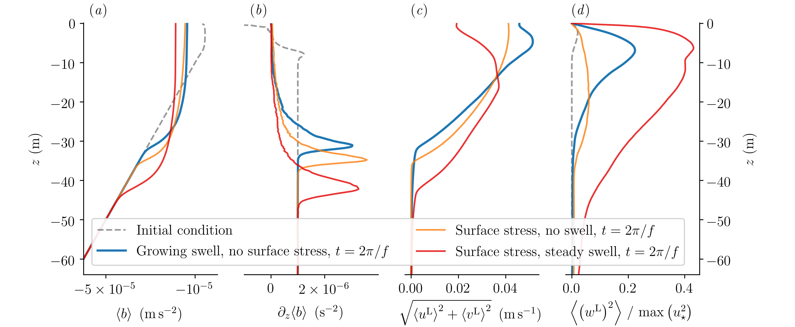

# WaveTransmittedTurbulence

Currents and turbulence beneath growing surface gravity waves.



<p align="center">
<i> Figure 1: Turbulence and currents transmitted to the ocean during surface gravity wave forcing by (highly idealized) pressure forcing and without wind, as modeled by large eddy simulations. The left panel shows vertical velocity contours normalized by the maximum effective friction velocity, while the right panel shows horizontally-averaged currents after 1/8th an inertial period and after a full inertial period. The initial boundary layer depth is around 8 meters.</i>
</p>



<p align="center">
<i> Figure 3: Vertical velocity contours in simulations of ocean surface boundary layer turbulence driven by wind both without waves (left) and beneath steady waves (center and right). The center panel reproduces results from McWilliams et al., "Langmuir Turbulence in the Ocean," JFM (1997).</i>
</p>

This repository contains [Julia](https://julialang.org) code for reproducing the simulation data and plots in 

> Wagner et al., "Near inertial waves and turbulence driven by the growth of surface waves", _in prep_

All software in this repository is written in Julia. The plots are produced with `PyPlot`, a Julia wrapper around the python package `matplotlib`.

## Reproduction of large eddy simulation results

The large eddy simulation (LES) data is generated by [Oceananigans.jl](https://github.com/climate-machine/Oceananigans.jl).

To reproduce all the publication's LES data (on a Unix-like system):

1. Install [Julia](https://julialang.org).

2. Clone this repository and change into its directory: 

```
git clone https://github.com/glwagner/WaveTransmittedTurbulence.git; cd WaveTransmittedTurbulence
```

3. Instantiate the environment: 

```
julia --project -e 'using Pkg; Pkg.instantiate()'
```

4. Run the spinup LES for section 3 (alll simulations will take some time with a high-octane GPU):

  ```
  julia --project simulations/run_free_convection.jl --buoyancy_flux 1e-9 --buoyancy_gradient 1e-6 --Nh 256 --Nz 256
  ```
  
5. Run the LESs of turbulence forced either by growing waves, or by pulses of wind, in section 3:

  * Run a LES of turbulence beneath growing waves (data from this LES is plotted in figure 1 above):
  
  ```
  julia --project simulations/run_growing_wave_forced.jl --spinup free_convection_Qb1.0e-09_Nsq1.0e-06_Nh256_Nz256 --wave_amplitude 2 --case growing_waves
  ```
  
  * Run a LES of turbulence beneath a wind stress pulse, with no waves:
  
  ```
  julia --project simulations/run_growing_wave_forced.jl --spinup free_convection_Qb1.0e-09_Nsq1.0e-06_Nh256_Nz256 --wave_amplitude 2 --case surface_stress_no_waves
  ```
  
  * Run a LES of turbulence beneath a wind stress pulse, with steady waves overhead:
  
  ```
  julia --project simulations/run_growing_wave_forced.jl --spinup free_convection_Qb1.0e-09_Nsq1.0e-06_Nh256_Nz256 --wave_amplitude 2 --case surface_stress_with_waves
  ```
 
6. Perform the initial condition study in section 4:

  * Run the 'control' LES forced by wind stress with no waves:
  
  ```
  julia --project simulations/run_initial_conditions_study.jl --Nh 256 --Nz 256 --initial_condition resting --wave_multiplier 0
  ```
  
  * Run the 'excited, 1x' LES forced by wind stress with steady waves and 'excited' initial conditions. This LES reproduces results from McWilliams et al., "Langmuir turbulence in the ocean," JFM (1997):
  
  ```
  julia --project simulations/run_initial_conditions_study.jl --Nh 256 --Nz 256 --initial_condition resting --wave_multiplier 1
  ```
  
  * Run the 'resting, 1x' LES forced by wind stress with steady waves and 'excited' initial conditions:
  
  ```
  julia --project simulations/run_initial_conditions_study.jl --Nh 256 --Nz 256 --initial_condition excited --wave_multiplier 1
  ```
  
  * Run the 'excited, 4x' LES, similar to 'excited, 1x' except with a 4x stronger wave field:
  
  ```
  julia --project simulations/run_initial_conditions_study.jl --Nh 256 --Nz 256 --initial_condition resting --wave_multiplier 4
  ```
  
  * Run the 'resting, 4x' LES, similar to 'resting, 1x' except for a 4x stronger wave field:
  
  ```
  julia --project simulations/run_initial_conditions_study.jl --Nh 256 --Nz 256 --initial_condition excited --wave_multiplier 4
  ```

## A few details

From the root of this repository, the command

```
julia --project simulations/run_free_convection.jl
```

runs a simulation of free convection at a default low resolution of `32 x 32 x 32` and default surface buoyancy flux `1e-9 m^2 / s^3`, which will complete on some laptops in a matter of minutes.
The simulation will execute on a GPU if one is available.

Some parameters can be specified on the command line.
To see these, type

```
julia --project simulations/run_free_convection.jl --help
```

To make more substantial changes to the setup, edit the script `simulations/run_free_convection.jl` directly.


# Corresponding

Feel free to raise an issue here or contact the corresponding author (Greg) at `gregory.leclaire.wagner@gmail.com`.
