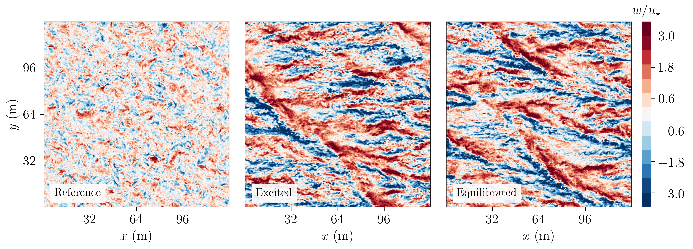

# WaveTransmittedTurbulence



*Vertical velocity contours in three simulations of wind- and wave-driven turbulence in the ocean surface boundary layer.*

[Julia](https://julialang.org) code reproducing the simulation data and plots in 

> Wagner et al., "Near inertial waves and turbulence driven by the growth of surface waves", _in prep_

All software in this repository is written in Julia. The plots are produced with `PyPlot`, a Julia wrapper for the python package `matplotlib`.

# Reproduction of large eddy simulation results

The large eddy simulation (LES) data is generated by [Oceananigans.jl](https://github.com/climate-machine/Oceananigans.jl).

To reproduce all the publication's LES data (on a Unix-like system):

1. Clone the repository and change into its directory: 

```
git clone https://github.com/glwagner/WaveTransmittedTurbulence.git; cd WaveTransmittedTurbulence
```

2. Instantiate the environment: 

```
julia --project -e 'using Pkg; Pkg.instantiate()'
```

3. Run the spinup simulations for section 3 (this will take some time with a high-octane GPU):

  * `julia --project simulations/run_free_convection.jl --buoyancy_flux 1e-9 --Nh 256 --Nz 256`
  * `julia --project simulations/run_free_convection.jl --buoyancy_flux 1e-8 --Nh 256 --Nz 256`
  
4. Run the science simulations in section 3:

  * `julia --project simulations/run_growing_wave_forced.jl --spinup free_convection_Qb1.0e-09_Nsq2.0e-06_Nh256_Nz256 --case growing_waves`
  * `julia --project simulations/run_growing_wave_forced.jl --spinup free_convection_Qb1.0e-09_Nsq2.0e-06_Nh256_Nz256 --case surface_stress_no_waves`
  * `julia --project simulations/run_growing_wave_forced.jl --spinup free_convection_Qb1.0e-09_Nsq2.0e-06_Nh256_Nz256 --case surface_stress_with_waves`
 
5. Run the simulations in section 4:

  *  `julia --project simulations/run_initial_conditions_study.jl --Nh 256 --Nz 256 --initial_condition resting --wave_multiplier 0`
  *  `julia --project simulations/run_initial_conditions_study.jl --Nh 256 --Nz 256 --initial_condition resting --wave_multiplier 1`
  *  `julia --project simulations/run_initial_conditions_study.jl --Nh 256 --Nz 256 --initial_condition excited --wave_multiplier 1`
  *  `julia --project simulations/run_initial_conditions_study.jl --Nh 256 --Nz 256 --initial_condition resting --wave_multiplier 4`
  *  `julia --project simulations/run_initial_conditions_study.jl --Nh 256 --Nz 256 --initial_condition excited --wave_multiplier 4`

# A few details

From the root of this repository, the command

```
julia --project simulations/run_free_convection.jl
```

runs a simulation of free convection at a default low resolution of `32 x 32 x 32` and default surface buoyancy flux `1e-9 m^2 / s^3`, which will complete on some laptops in a matter of minutes.
The simulation will execute on a GPU if one is available.

Some parameters can be specified on the command line.
To see these, type

```
julia --project simulations/run_free_convection.jl --help
```

To make more substantial changes to the setup, edit the script `simulations/run_free_convection.jl` directly.


# Corresponding

Feel free to raise an issue here or contact the corresponding author (Greg) at `gregory.leclaire.wagner@gmail.com`.
